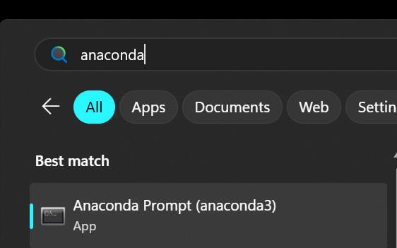
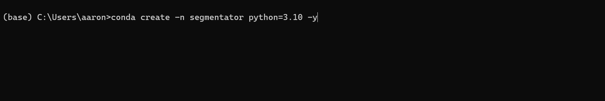
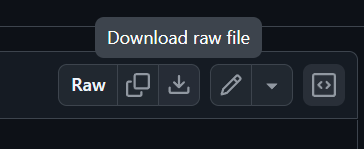

# Medical Image Segmentation Pipeline — Setup & Usage Guide

This guide walks you through setting up the environment and running the segmentation pipeline on Windows and Mac. No prior programming experience is required.

---

## What Does This Pipeline Do?

This pipeline takes CT or MRI scans in DICOM format and automatically segments anatomical structures using **TotalSegmentator**, a deep learning tool developed at University Hospital Basel. It can identify over 100 different structures including organs, bones, muscles, vessels, and brain regions.

The script handles the full workflow:
1. Reads your DICOM folders
2. Automatically selects the best image series
3. Converts to the NIfTI format that TotalSegmentator requires
4. Runs segmentation
5. Saves results for viewing in 3D Slicer or analysis in Python

---

## 1. Install Miniconda

Miniconda is a lightweight tool that manages Python and its packages. Think of it as an app store for scientific software.

To install Miniconda, follow the instructions for [Windows](https://www.anaconda.com/docs/getting-started/miniconda/install/windows-gui-install) and [Mac](https://www.anaconda.com/docs/getting-started/miniconda/install/mac-gui-install).

## 2. Create the Conda Environment

A conda environment is an isolated workspace that keeps all the required packages together without affecting anything else on your computer. You only need to do this once.

### Open your terminal

- **Windows:** Open **Anaconda Prompt** from the Start Menu
- **Mac:** Open **Terminal**

<p align="center">
  
</p>

### Create and activate the environment

```bash
# copy and paste each line into the terminal and hit enter after each line
conda create -n segmentator python=3.10 -y
conda activate segmentator
```

<p align="center">
  
</p>

You should now see `(segmentator)` instead of `(base)` at the start of your prompt, confirming the environment is active.

### Install the required packages

**Windows (with NVIDIA GPU):**
```bash
pip install pydicom dicom2nifti nibabel numpy totalsegmentator torch torchvision torchaudio --index-url https://download.pytorch.org/whl/cu124
```

**Mac (or Windows without NVIDIA GPU):**
```bash
pip install pydicom dicom2nifti nibabel numpy totalsegmentator torch torchvision torchaudio
```

---

## 3. Opening the Terminal for Future Use

Every time you want to run the pipeline, you need to open your terminal and activate the environment.

**Windows:**
1. Open **Anaconda Prompt** from the Start Menu
2. Run: `conda activate segmentator`

**Mac:**
1. Open **Terminal**
2. Run: `conda activate segmentator`

You should see `(segmentator)` at the start of your prompt before proceeding.

---

## 4. Navigating to Your Files

Before running the script, navigate to the folder where your DICOM data is stored using the `cd` command (change directory).

```bash
# Windows
cd C:\Users\yourname\Documents\research\data

# Mac
cd /Users/yourname/Documents/research/data
```

> **Tip:** You can drag and drop a folder from File Explorer (Windows) or Finder (Mac) into the terminal window to automatically paste its path.

---

## 5. Unzipping DICOM Files (if needed)

If your DICOM folders are stored as `.zip` files, unzip them all before running the script. First use the `cd` command to navigate to DICOM folder, the run the command below:

**Windows (Anaconda Prompt):**
```bash
for %f in (*.zip) do powershell -command "Expand-Archive -Path '%f' -DestinationPath '%~nf'"
```

**Mac (Terminal):**
```bash
for f in *.zip; do unzip "$f" -d "${f%.zip}"; done
```

Each zip file will be extracted into a folder of the same name in the current directory.

---

## 6. About TotalSegmentator Tasks

TotalSegmentator organises its models into **tasks** — each task targets a specific set of anatomical structures. For a full list of tasks, see [here](https://github.com/wasserth/totalsegmentator?tab=readme-ov-file#subtasks).

Some tasks, such as `brain_structures`, require a license. You can get a license through this [form](https://backend.totalsegmentator.com/license-academic/) (it's free). You should get an email with your license. To set your license (so that the tool knows you have one), run the following command:

```bash
totalseg_set_license -l {your license here}
```

Replace `{your license here}` with your license code.

---

## 7. Running the Segmentation Script

### Download the scripts
(if you already know how to use Git, you can ignore)

Download the python file [here](https://github.com/ayhsieh/ct-segmentator/blob/main/segment_structures.py). There should be a download button that looks like this:


<p align="center">
  
</p>
Place `segment_structures.py` in the same folder as where your DICOM folder(s) is (or anywhere accessible), then run:

### Process a single patient folder
The `--task` flag is **required** — you must always specify what to segment:

```bash
python segment_structures.py --task brain_structures path/to/PATIENT_FOLDER
```

### Process all patient folders at once
```bash
python segment_structures.py --task brain_structures path/to/folder/containing/all/patients
```

### Task examples

```bash
# Segment brain structures (ventricles, lobes, cerebellum, etc.)
python segment_structures.py --task brain_structures path/to/patients

# Segment all 117 major structures
python segment_structures.py --task total path/to/patients

# Segment lung vessels
python segment_structures.py --task lung_vessels path/to/patients

# Segment on MRI instead of CT
python segment_structures.py --task total_mr path/to/patients
```

### What happens next

The script will scan each folder and either:

- **[AUTO]** — automatically select the best series and proceed
- **[CACHE]** — use a previously saved selection and proceed
- **[SKIP]** — skip folders that already have a completed segmentation
- **[MANUAL]** — ask you to pick a series when it can't decide automatically

For manual selection, you will see a numbered list like:
```
  Folder: PATIENT_001
  No single candidate auto-detected. Please pick one (or -1 to skip):
    [1] [series  1] [   2 slices]  SCOUT
    [2] [series  3] [ 245 slices]  Head  0.75  J40f
    [3] [series  4] [ 245 slices]  Head  0.75  BONE J70h

  Enter number (1-3), or -1 to skip:
```

Type the number of the series you want (in this case `2`) and press Enter. Your choice is saved automatically so you won't be asked again for the same patient next time.

### Skip manual prompts on repeat runs

If you've already made all your selections and just want to re-run segmentation on any folders missing output:
```bash
python segment_structures.py path/to/patients --skip-planning
```

### Force re-run all segmentations
```bash
python segment_structures.py path/to/patients --force-redo
```

---

## 8. Output

Results are saved in two folders created automatically in your current directory:

- `converted_nifti/` — the NIfTI files converted from DICOM, one per patient
- `total_segmentor_results/` — one subfolder per patient, containing:
  - One `.nii.gz` file per segmented structure (e.g. `ventricle.nii.gz`, `frontal_lobe.nii.gz`)
  - `statistics.json` — volumes in mm³ for each structure

These files can be loaded directly into **3D Slicer** for visualisation.

To create a csv file of everything, download `combine.py` [here](https://github.com/ayhsieh/ct-segmentator/blob/main/combine.py) (or with `git clone` if familiar) and run:

```bash
python combine.py
```