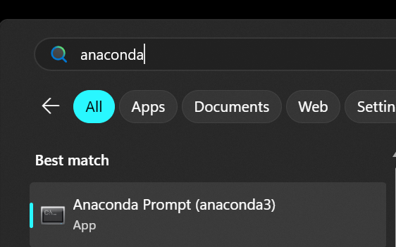
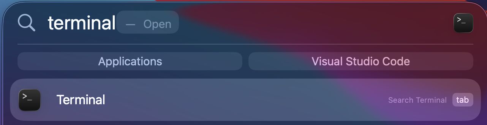
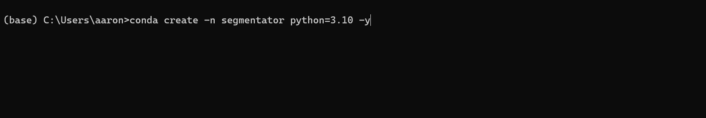
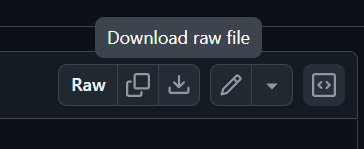

# Medical Image Segmentation — Setup & Usage Guide

This tool takes CT or MRI scans in DICOM format and automatically segments anatomical
structures using **TotalSegmentator**, a deep learning tool developed at University
Hospital Basel. It can identify over 100 structures including organs, bones, muscles,
vessels, and brain regions.

You use it through a window in your web browser. It runs entirely on your own computer
— no scans are uploaded anywhere, and nothing is copied out of the folder they already
live in.

It handles the whole workflow: reading your DICOM folders, picking the right image
series, converting to NIfTI, running the segmentation, and giving you a spreadsheet of
volumes.

---

## 1. Install Miniconda

Miniconda manages Python and its packages. Think of it as an app store for scientific
software.

Follow the instructions for [Windows](https://www.anaconda.com/docs/getting-started/miniconda/install/windows-gui-install)
or [Mac](https://www.anaconda.com/docs/getting-started/miniconda/install/mac-gui-install).

## 2. Create the environment

You only do this once.

### Open your terminal

- **Windows:** open **Anaconda Prompt** from the Start Menu
- **Mac:** open **Terminal**

<p align="center">
  
</p>

<p align="center">
  
</p>

### Create and activate it

```bash
conda create -n segmentator python=3.10 -y
conda activate segmentator
```

<p align="center">
  
</p>

You should see `(segmentator)` at the start of your prompt.

### Install the packages

**Windows (with NVIDIA GPU):**
```bash
pip install pydicom dicom2nifti nibabel numpy scipy matplotlib pandas pynrrd totalsegmentator torch torchvision torchaudio --index-url https://download.pytorch.org/whl/cu124
```

**Mac (or Windows without an NVIDIA GPU):**
```bash
pip install pydicom dicom2nifti nibabel numpy scipy matplotlib pandas pynrrd totalsegmentator
```

## 3. Download the tool

Download this repository and unzip it somewhere you can find again — your Documents
folder is fine.

<p align="center">
  
</p>

---

## Starting it

### Windows

Double-click **`start.bat`**. A black window opens and your browser follows a moment
later. Leave the black window open while you work; closing it stops the tool.

### Mac

Double-click **`start.command`**.

The first time, macOS blocks it twice. Both are one-offs.

**Make it runnable.** Right-click `start.command`, hold **Option**, and choose
**Copy "start.command" as Pathname**. Open Terminal, type `chmod +x ` (with a space at
the end), paste, and press Enter:

```bash
chmod +x /Users/you/Documents/ct-segmentator/start.command
```

**Let it open.** Right-click `start.command` and choose **Open**, then **Open** again
in the dialog. After this, double-clicking works normally.

### If nothing opens

The window will tell you if it cannot find the `segmentator` environment. In that case
open a terminal, `conda activate segmentator`, `cd` to this folder, and run:

```bash
python ct_gui.py --open
```

---

## Using it

### Make a project

A project points at a folder of scans. Click **New project**, then **Choose folder…** —
your normal Windows or Mac folder chooser opens. Pick the folder that holds one subfolder
per patient.

The tool finds the patient folders, shows them, and creates the project. Your DICOMs are
not copied or moved — everything it generates goes into a `projects/` folder inside the
tool's own directory.

> If your scans are still in `.zip` files, unzip them first. The tool will warn you if it
> sees any, because the pipeline deletes zip files after extracting them.

### Choose what to segment

Search the list of 40 structure sets — every task TotalSegmentator offers — tick what you
want, and press **Start segmenting**. Some are marked **licence**: those need a free
academic licence number, which you can request
[here](https://backend.totalsegmentator.com/license-academic/). Paste it into the box that
appears. If you have entered one before, TotalSegmentator remembers it and the box does not
appear at all.

Tasks whose name ends in `_mr` are for MRI, not CT.

Two extra analyses are listed below the structures: **cranial fossa volumes** and
**brain and intracranial volume**. Both need `brain_structures` to have been run first.

Anything already done is marked and skipped. Tick **re-run even if done** to force it.

### Watch it run

You get a live log, a progress bar, and a timer. Segmentation takes roughly a minute per
patient per structure set on a GPU, considerably longer on a laptop without one.

Only one job runs at a time. A second one says **Queued** until the first finishes. You
can close the browser and come back — the work carries on.

### Check the series (optional)

A scan usually contains several reconstructions of the same acquisition — a soft-tissue
one, a bone one, sometimes a coronal reformat. The tool scores them and picks the best,
and this is right almost always.

**Check series first** shows you what it picked and why. Where two are close it asks you
to choose. If you are unsure which is which, open the folder in 3D Slicer and look — you
want a soft-tissue axial reconstruction of the whole head.

### Get your results

Under **Results**, press **Build** then **Download** for:

- **All structure volumes** — every structure from every task, one row per patient
- **Brain and ICV** — parenchyma and intracranial volume
- **Cranial fossa volumes** — anterior, middle and posterior compartments

Segmentations are also saved as `.seg.nrrd` files you can open directly in **3D Slicer**,
under `projects/<your project>/total_segmentor_results_<your project>/`.

### Adding more later

Open the project again and tick another structure. It only runs the new one — nothing is
redone and nothing is re-imported.

### Correcting fossa boundaries

If you ran the cranial fossa analysis, each patient row gets a **review fossa** link. It
shows the skull floor from above, with the boundaries the tool chose. If one is wrong,
click along where it should be and press **Apply and recompute**. Your correction is kept
and survives future runs; **Drop corrections** puts it back.

---

## Using it from the command line

The browser tool is a front end for four scripts, which still work on their own:

```bash
python segment_structures.py --group STUDY --task brain_structures
python segment_fossae.py --group STUDY
python brain_icv.py --group STUDY
python produce_table.py --group STUDY
```

By default these look for study folders under `ct_scans/`. Set `CT_DATA_ROOT` to keep
your scans somewhere else.

To check your installation:

```bash
python ct_gui.py --selftest
```
